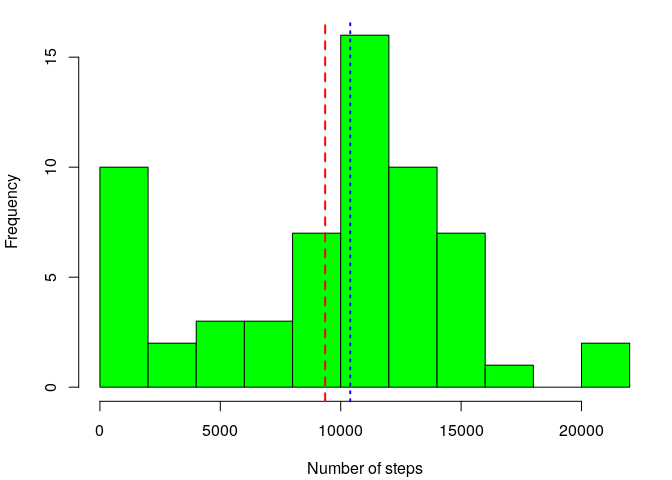
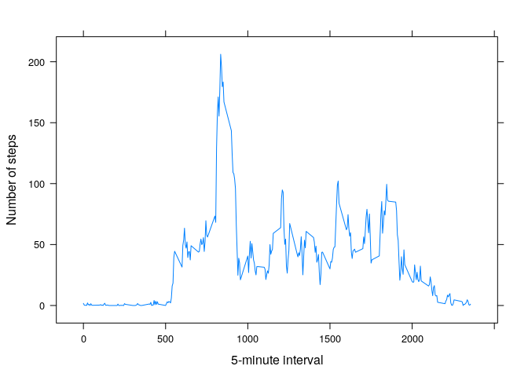
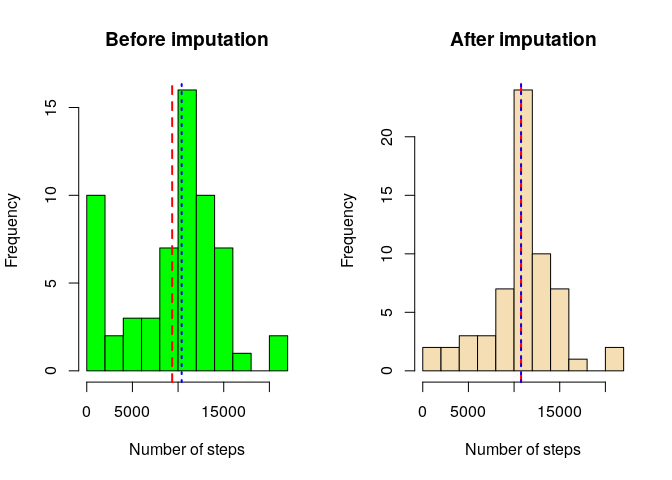
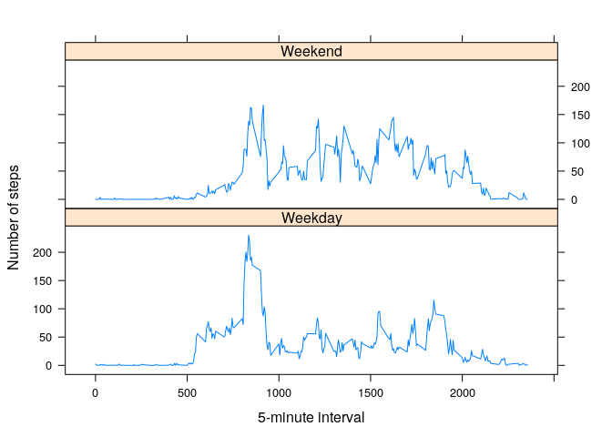

# Course Project #1


- Loading `dplyr` and `lattice` libraries

```r
library(dplyr)
library(lattice)
```


## Loading and preprocessing the data

```r
unzip("activity.zip")
df <- read.csv("activity.csv")
df$date <- as.Date(df$date, format = "%Y-%m-%d") # Formating date variable
```


## What is mean total number of steps taken per day?


```r
par(mfrow = c(1,1), mar = c(4.1, 4.1, 1.1, 1.1)) # setting parameters for plot

# Calculation of total number of steps taken per day
per_day <- df %>%
    group_by(date) %>% 
    summarise(`Number of steps` = sum(steps, na.rm = T))

# Building histogram with mean and median
with(per_day, hist(`Number of steps`, 
                   main = "", breaks = 12, col = "green"))
a <- mean(per_day$`Number of steps`, na.rm = T)
abline(v = a, lty = 2, col = "red", lwd = 2)
b <- median(per_day$`Number of steps`, na.rm = T)
abline(v = b, lty = 3, col = "blue", lwd = 2)
```

<!-- -->


- The mean of the total number of steps taken per day is equal to **9354** (red dashed line on the plot)

- The median of the total number of steps taken per day is equal to **10395** (blue dotted line on the plot)


## What is the average daily activity pattern?


```r
# Calculation of the average number of steps taken averaged across all days
per_int <- df %>% 
    rename(`5-minute interval` = interval) %>% 
    group_by(`5-minute interval`) %>%
    summarise(`Number of steps` = mean(steps, na.rm = T))
m1 <- per_int$`5-minute interval`[which.max(per_int$`Number of steps`)]
m2 <- max(per_int$`Number of steps`)
# Bulding time series plot 
xyplot(`Number of steps` ~ `5-minute interval`, data = per_int, type = "l")
```

<!-- -->


- **835'th** 5-minute interval, on average across all the days in the dataset, contains the maximum number of steps (= 206)


## Imputing missing values using the median for that 5-minute interval


```r
mis <- sum(is.na(df$steps))

# Imputing missing values using the median for that 5-minute interval
df1 <- df %>%
    group_by(interval) %>% 
    mutate(steps = unlist(tapply(steps, interval, 
                                 function(x) ifelse(is.na(x), 
                                                    mean(x, na.rm = T), x))))
# Building histograms
per_day_imp <- df1 %>% 
    group_by(date) %>% 
    summarise(`Number of steps` = sum(steps))

par(mfrow = c(1, 2)) # setting parameters for plots
# Before the imputation
with(per_day, hist(`Number of steps`, 
                   main = "Before imputation", breaks = 12, col = "green"))
abline(v = mean(per_day$`Number of steps`, na.rm = T),
       lty = 2, col = "red", lwd = 2)
abline(v = median(per_day$`Number of steps`, na.rm = T),
       lty = 3, col = "blue", lwd = 2)
# After the imputation
with(per_day_imp, hist(`Number of steps`, 
                       main = "After imputation", breaks = 12, col = "wheat"))
a1 <- mean(per_day_imp$`Number of steps`)
abline(v = a1, lty = 2, col = "red", lwd = 2)
b1 <- median(per_day_imp$`Number of steps`)
abline(v = b1, lty = 3, col = "blue", lwd = 2)
```

<!-- -->

Original dataset contains **2304** missing values.

There are some differencies between measures of central tendency before and after imputation

- Means are represented as red dashed lines

    * Before the imputation the mean was equal to **9354**
    
    * After the imputation the mean is equal to **10766**
    
- Medians are represented as blue dotted lines

    * Before the imputation the median was equal to **10395**
    
    * After the imputation the median is equal to **10766**

## Are there differences in activity patterns between weekdays and weekends?


```r
df1$week <- ifelse(weekdays(df$date) %in% unique(weekdays(df$date))[1:5],
                   "Weekday", "Weekend")               # New variable
# Calculation of the average number of steps taken averaged across all  all weekday days or weekend days
per_week <- df1 %>% 
    rename(`5-minute interval` = interval) %>% 
    group_by(week, `5-minute interval`) %>% 
    summarise(`Number of steps` = mean(steps))

# Bulding time series panel plots 
xyplot(`Number of steps` ~ `5-minute interval` | week, 
       data = per_week, type = "l", layout = c(1,2))
```

<!-- -->

There are differences in activity patterns: weekdays are not accompanied by a marked peak of activity

## Session Info

```r
sessionInfo()
```

```
## R version 3.4.4 (2018-03-15)
## Platform: x86_64-pc-linux-gnu (64-bit)
## Running under: Ubuntu 18.04 LTS
## 
## Matrix products: default
## BLAS: /usr/lib/x86_64-linux-gnu/blas/libblas.so.3.7.1
## LAPACK: /usr/lib/x86_64-linux-gnu/lapack/liblapack.so.3.7.1
## 
## locale:
##  [1] LC_CTYPE=en_US.UTF-8       LC_NUMERIC=C              
##  [3] LC_TIME=ru_RU.UTF-8        LC_COLLATE=en_US.UTF-8    
##  [5] LC_MONETARY=ru_RU.UTF-8    LC_MESSAGES=en_US.UTF-8   
##  [7] LC_PAPER=ru_RU.UTF-8       LC_NAME=C                 
##  [9] LC_ADDRESS=C               LC_TELEPHONE=C            
## [11] LC_MEASUREMENT=ru_RU.UTF-8 LC_IDENTIFICATION=C       
## 
## attached base packages:
## [1] stats     graphics  grDevices utils     datasets  methods   base     
## 
## other attached packages:
## [1] bindrcpp_0.2.2  lattice_0.20-35 dplyr_0.7.5     knitr_1.20     
## 
## loaded via a namespace (and not attached):
##  [1] Rcpp_0.12.17     digest_0.6.15    rprojroot_1.3-2  assertthat_0.2.0
##  [5] grid_3.4.4       R6_2.2.2         backports_1.1.2  magrittr_1.5    
##  [9] evaluate_0.10.1  pillar_1.2.3     rlang_0.2.1      stringi_1.2.2   
## [13] rmarkdown_1.9    tools_3.4.4      stringr_1.3.1    glue_1.2.0      
## [17] purrr_0.2.5      yaml_2.1.19      compiler_3.4.4   pkgconfig_2.0.1 
## [21] htmltools_0.3.6  tidyselect_0.2.4 bindr_0.1.1      tibble_1.4.2
```

